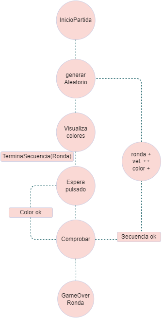

# Simon Dice
Proyecto PMDM

## Contenido
_Consiste en una aplicación en Android Studio utilizando diferentes librerías._
_Se ha utilizado el modelo MVVM para la realización de este proyecto._

## Preview
__imagen contenido del repositorio en interfaz gráfica__

__Esquema de casos de estado y casos de uso de la aplicación Simon Dice__

 
